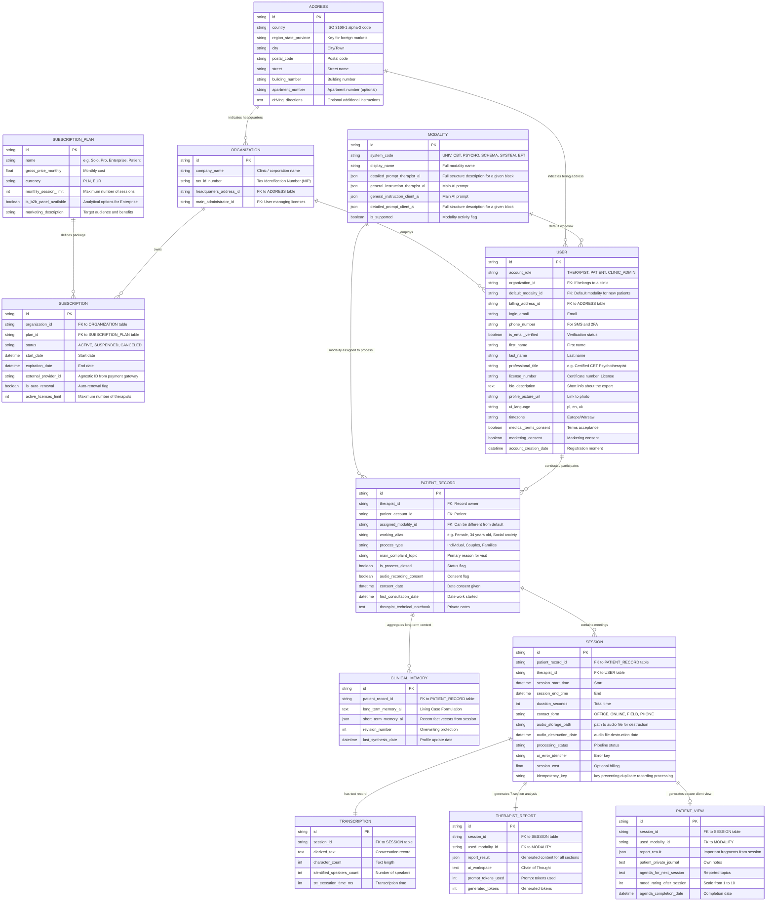

# Superwizor AI - Model Danych i Data Flow

Poniżej znajduje się oficjalny model relacyjny (ERD) oraz definicje struktur bazodanowych w aplikacji Superwizor AI. Baza danych docelowa to Cloud SQL PostgreSQL 16.

## Diagram ER (Zależności encji)

